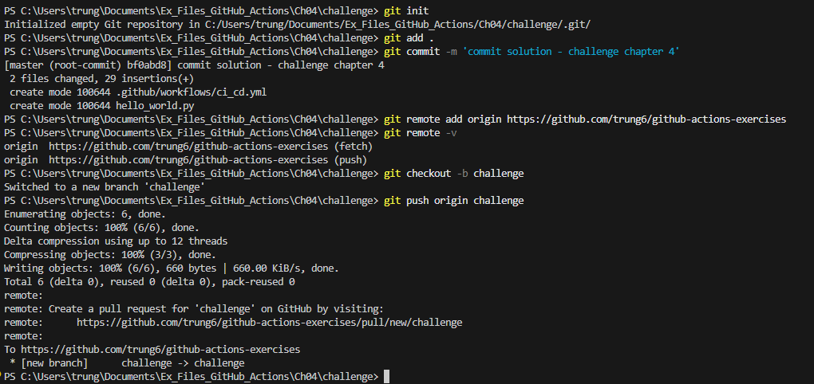

Here’s a clean way to push your local folder (just initialized with git init) to a new branch on an existing GitHub repo:

1. Initialize and add your files
```
cd <folder>
git init
git add .
git commit -m "<commit message>"
```
2. Add the remote
```
git remote add origin <URL> # Replace <URL> with your repo’s URL (SSH or HTTPS):

git remote -v # You can check it’s added correctly with:
```
3. Create and switch to a new branch
```
git checkout -b <new branch name>
```
4. push to github
```
git push origin <new branch name>
```
Example:<br>
